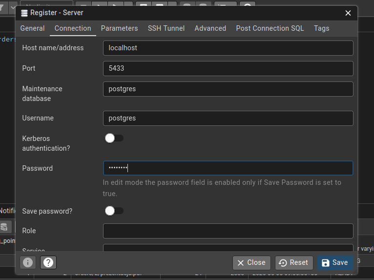
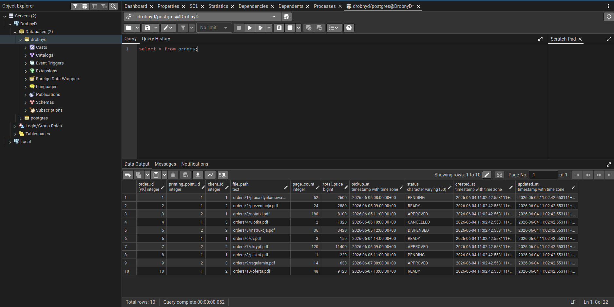

## O Dockerze

Docker wykorzystuje mechanizmy izolacji dostępne w jądrze Linuxa (m.in. namespaces i cgroups), dzięki którym możliwe jest uruchamianie aplikacji w odseparowanych środowiskach zwanych kontenerami. W porównaniu do maszyn wirtualnych kontenery są znacznie lżejsze, uruchamiają się szybciej i zużywają mniej zasobów, ponieważ współdzielą jądro systemu operacyjnego.

Na systemie Linux Docker działa bezpośrednio na jądrze systemu. Na systemach Windows i macOS wymagany jest Docker Desktop, który uruchamia niewielką maszynę wirtualną z Linuxem. Wszystkie kontenery działają wewnątrz tej maszyny, dzięki czemu zachowują się identycznie niezależnie od używanego systemu operacyjnego.

Aplikacje uruchamiane przez Dockera są dostarczane w postaci obrazów (images). Obraz zawiera kompletną konfigurację potrzebną do uruchomienia danego programu. Przykładowo obraz postgres:18 zawiera gotową instalację PostgreSQL 18. Po pobraniu obrazu Docker może utworzyć na jego podstawie kontener i uruchomić działającą instancję bazy danych.

## Uruchamianie bazy danych

Przede wszystkim, zainstalujcie **Docker** lub **Docker Desktop** (Windows / macOS).

Następnie możecie skorzystać z gotowych skryptów.
> Jeśli korzystacie z Windows, musicie uruchamiać skrypty przy pomocy Git Bash (instalowany razem z Git for Windows).

Zakładając, że znajdujecie się terminalem w głównym folderze projektu:

- `db/scripts/start.sh`

Startuje Postgres w kontenerze Docker.
Jedynie pierwsze wywołanie utworzy samą bazę oraz wywoła skrypty SQL znajdujące się w folderze `db/init`, które tworzą tabele oraz dodają seed (czyli dane początkowe / testowe).

- `db/scripts/stop.sh`

Zatrzymuje kontener z Postgresem.

- `db/scripts/start.sh --watch`

Uruchamia Postgres w trybie nasłuchiwania. Wtedy zamiast wykonywać skrypt `stop.sh`, wystarczy zabić sam proces w terminalu przez naciśnięcie `Ctrl + C`.

- `db/scripts/reset.sh`

Resetuje bazę danych do stanu początkowego.
Domyślnie, wszelkie zmiany jakich dokonacie w bazie danych będą zapisywane w Waszym lokalnym systemie plików i nie utracicie ich po restarcie. Jednak wykonanie tego skryptu te zmiany usunie.

- `db/scripts/dump.sh`

Zastąpi plik `db/backups/dump.sql` aktualnym stanem bazy danych. Taki plik jest wersjonowany (zapisywany w repozytorium git), dzięki czemu dane te można łatwo odzyskać. Może przyjąć opcjonalny argument określający alternatywną nazwę pliku wynikowego, np: `db/scripts/dump.sh sprint-3` utworzy plik `db/backups/sprint-3.sql`

- `db/scripts/restore.sh`

Usuwa obecny stan bazy danych i przywraca stan zapisany w pliku `db/backups/dump.sql`.

- `db/scripts/run.sh`

Otwiera interaktywną konsolę, w której można wpisywać polecenia SQL i testować bazę danych.
Podpowiedź: wpisanie `quit` zamyka konsolę.

## Testowanie bazy danych

Najłatwiej przetestować przez powyższy skrypt `db/scripts/run.sh`.

Alternatywnie, dla bardziej zaawansowanego użycia, można zainstalować program **pgAdmin 4**.
Po instalacji należy zarejestrować nowy serwer i w konfiguracji wpisać:

Password: pgadmin

Po tym wystarczy otworzyć *Query Tool*, będąc w bazie danych *drobnyd*

Bardziej ogólnie, PostgreSQL jest dostępny pod:
- Host: localhost
- Port: 5433
- Database: drobnyd
- User: postgres
- Password: postgres

